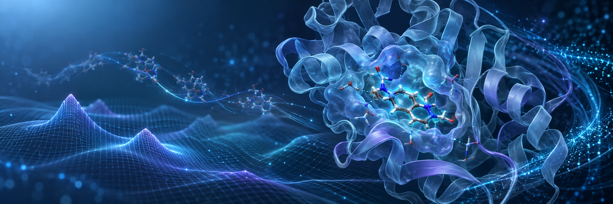
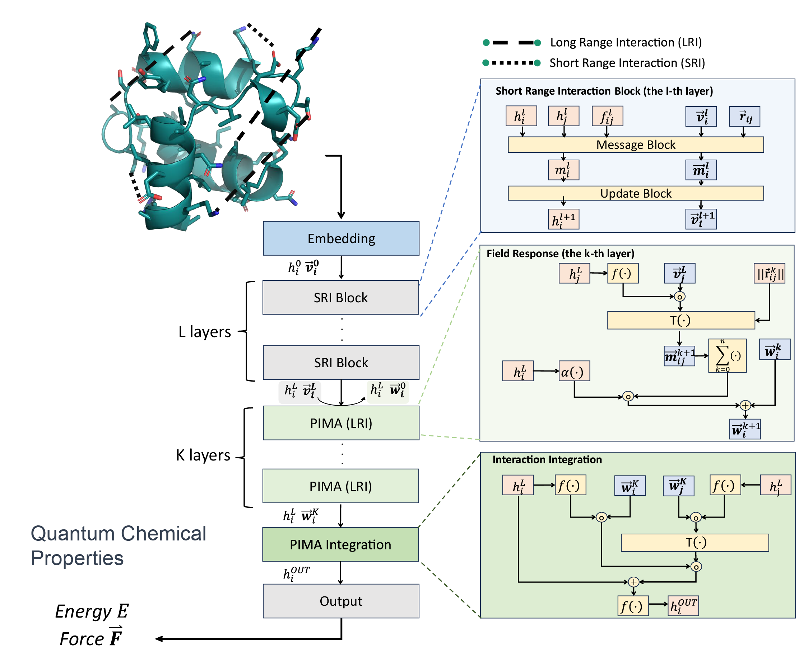
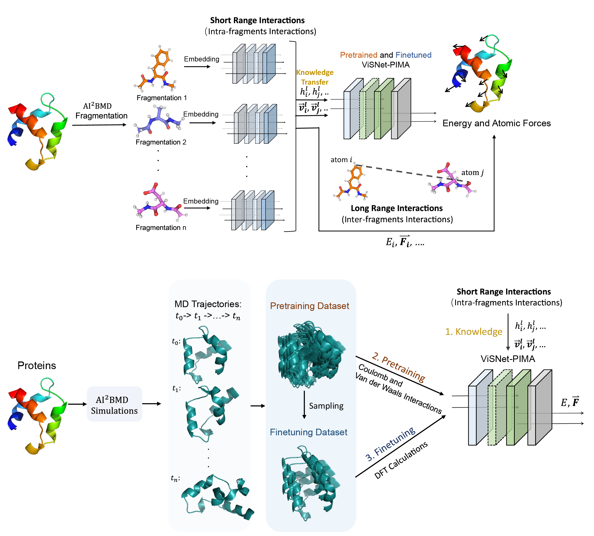
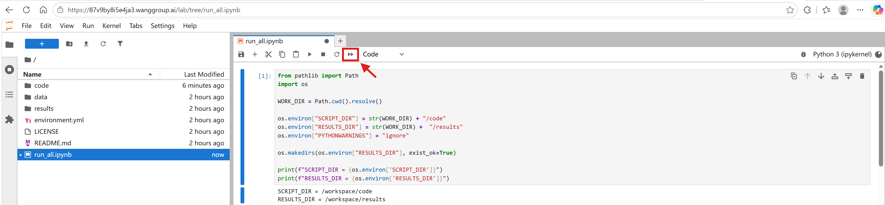
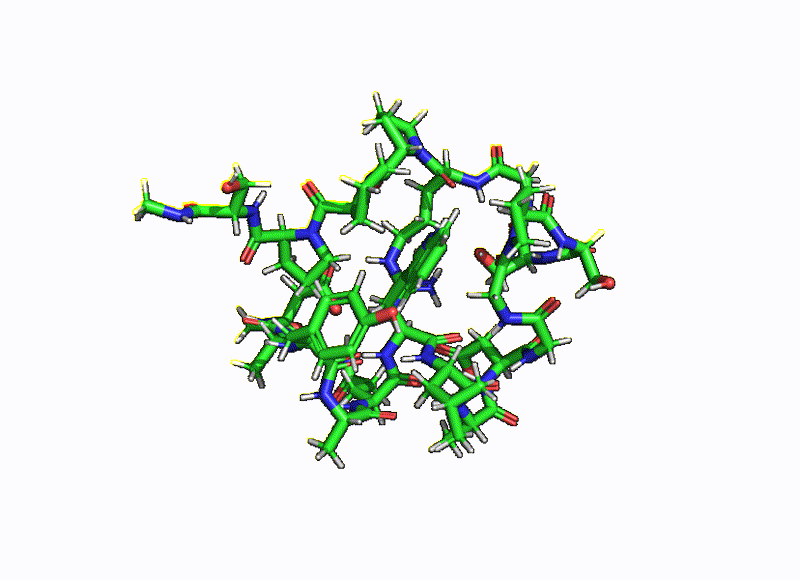

<p align="center">
  
</p>

<h1 align="center">
  Enhancing long-range interaction modeling for <i>ab initio</i> biomolecular calculations and simulations with ViSNet-PIMA
</h1>

<p align="center">
  <a></a>
  <a></a>
  <a></a>
</p>

## Overview

ViSNet-PIMA (short for “**ViSNet** with **P**hysics-**I**nformed **M**ultipole **A**ggregator”) combines multipole expansion theory with ViSNet to accurately model both short-range and long-range molecular interactions, outperforming state-of-the-art MLFFs in energy and force predictions.



AI<sup>2<sup>BMD-PIMA integrates ViSNet-PIMA into protein simulations through a three-stage "Transfer Learning--Pretraining--Finetuning" strategy. It transfers local fragment representations, pretrains non-local interactions on molecular mechanics (MM) data, and finetunes with limited DFT labels, enabling accurate inter-fragment energy and force predictions at substantially reduced computational and data costs for biomolecular simulations.



## 🌟 Quick Start

### **We have provided a Jupyter Notebook named [`run_all.ipynb`](./run_all.ipynb). Users can click the `Run All` button to reproduce all the results.**



Users can also open a terminal and run:

```bash
bash ./run_all.sh
```

This command sequentially runs all evaluation tasks and displays the consolidated results.

These experimental results are also saved in the [`results`](./results) folder. Meanwhile, the generated simulation trajectories are saved in [`code/AI2BMD-PIMA_simulation/Logs-1_rep_chig.c0/SimulationResults/*`](./code/AI2BMD-PIMA_simulation/Logs-1_rep_chig.c0/SimulationResults), including the [`.traj`](./code/AI2BMD-PIMA_simulation/Logs-1_rep_chig.c0/SimulationResults/1_rep_chig.c0-traj.traj) and [`.pdb`](./code/AI2BMD-PIMA_simulation/Logs-1_rep_chig.c0/SimulationResults/1_rep_chig.c0-traj.pdb) files.

## Environments

### 1. Introduction

Our environment is based on Docker, and the conda environment `PIMA` will be activated automatically for running.

The environment uses `Python 3.11`, `PyTorch 2.8.0` with `CUDA 12.8`, and the corresponding `PyTorch Lightning` and `PyTorch Geometric` extensions, as well as `jax[cuda12] 0.4.33`.

### 2. Activate the Conda environment (optional)

From the repository root, run:

```bash
conda activate PIMA
```

## Reproduction Workflow

Run the complete workflow with the following command:

```bash
bash ./run_all.sh
```

The master script executes the following stages in order:

| Order | Evaluation | Entry point | Primary output |
|:---:|---|---|---|
| 1 | AIMD-Chig | [`inference_Chig.sh`](./code/ViSNet-PIMA_test_on_Chig_and_MD22/inference_Chig.sh) | `results/log_Chig/inference_results.pt` |
| 2 | MD22 | [`inference_MD22.sh`](./code/ViSNet-PIMA_test_on_Chig_and_MD22/inference_MD22.sh) | `results/log_md22_*/inference_results.pt` |
| 3 | Trp-cage learning curve and ablation study | [`inference_Trp-cage.sh`](./code/ViSNet-PIMA_train_and_test_on_Trp/inference_Trp-cage.sh) | `results/log_learning_curve_and_ablation_studys/*/inference_results.pt` |
| 4 | NCI Atlas | [`inference_NCIA.sh`](./code/ViSNet-PIMA_test_on_NCIA/inference_NCIA.sh) | `results/log_NCIA/ncia_binding_visnet-pima.csv` |
| 5 | Simulation | [`simulation.sh`](./code/AI2BMD-PIMA_simulation/simulation.sh) | `code/AI2BMD-PIMA_simulation/Logs-1_rep_chig.c0/SimulationResults/*` |

All terminal output produced by the unified workflow is also saved to:

[`results/show_results_tables/*.csv`](./results/show_results_tables) and [`results/output.log`](./results/output.log)

### MD22 evaluation order

The seven MD22 subsets are evaluated in the following order, matching [`inference_MD22.sh`](./code/ViSNet-PIMA_test_on_Chig_and_MD22/inference_MD22.sh):

1. Ac-Ala3-NHMe
2. DHA
3. Stachyose
4. AT-AT
5. AT-AT-CG-CG
6. Buckyball catcher
7. Double-walled nanotube

### Trp-cage evaluation order

The learning-curve and ablation models are evaluated in the following order, matching [`inference_Trp-cage.sh`](./code/ViSNet-PIMA_train_and_test_on_Trp/inference_Trp-cage.sh):

1. 20% finetuned with pretraining
2. 40% finetuned with pretraining
3. 60% finetuned with pretraining
4. 80% finetuned with pretraining
5. 100% finetuned with pretraining
6. 100% finetuned without pretraining

## Running Individual Evaluation Stages

Each stage can be run independently from the repository root while preserving the same order and configuration used by the unified workflow.

### 1. MD22

```bash
bash code/ViSNet-PIMA_test_on_Chig_and_MD22/inference_MD22.sh
```

### 2. AIMD-Chig

```bash
bash code/ViSNet-PIMA_test_on_Chig_and_MD22/inference_Chig.sh
```

### 3. Trp-cage learning curve and ablation study

```bash
bash code/ViSNet-PIMA_train_and_test_on_Trp/inference_Trp-cage.sh
```

### 4. NCI Atlas

```bash
bash code/ViSNet-PIMA_test_on_NCIA/inference_NCIA.sh
```

### 5. Consolidated result display

After all required result files have been generated, display the consolidated tables with:

```bash
python code/show_results.py
```

The summary contains the AIMD-Chig results, all seven MD22 subsets, the six Trp-cage learning-curve and ablation results, and the NCI Atlas interaction-energy results.

### 6. Simulation and calculation with AI<sup>2</sup>BMD-PIMA

We provide scripts for running molecular dynamics simulation with AI<sup>2</sup>BMD-PIMA (demo protein is Chignolin). Run the following commands from the repository root:

```bash
bash code/AI2BMD-PIMA_simulation/simulation.sh
```

The animation below shows a Trp-cage molecular dynamics trajectory (solvent omitted) generated with the AI<sup>2</sup>BMD-PIMA simulation workflow.

<p align="center">
  
</p>


## Training

### AIMD-Chig

To train ViSNet-PIMA on AIMD-Chig, run:

```bash
CUDA_VISIBLE_DEVICES=0 python code/ViSNet-PIMA_test_on_Chig_and_MD22/train.py \
  --conf code/ViSNet-PIMA_test_on_Chig_and_MD22/examples_MD22_AIMD-Chig/ViSNet-Chignolin.yml \
  --dataset-root data/AIMD-Chig \
  --log-dir results/log_Chig
```

Example training configuration files for the other datasets are provided in [`examples_MD22_AIMD-Chig`](./code/ViSNet-PIMA_test_on_Chig_and_MD22/examples_MD22_AIMD-Chig/) and can be used in the same way.

### MD22

To train ViSNet-PIMA on any subset of MD22, run:

```bash
CUDA_VISIBLE_DEVICES=0 python code/ViSNet-PIMA_test_on_Chig_and_MD22/train.py \
  --conf code/ViSNet-PIMA_test_on_Chig_and_MD22/examples_MD22_AIMD-Chig/ViSNet-MD22-*.yml \
  --dataset-root data/md22-dataset \
  --log-dir results/log_MD22-*
```

## License

This project is licensed under the terms of the [`MIT License`](./LICENSE).
